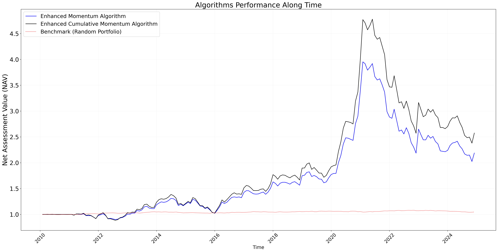

# eToro Hiring Process Assignment Prooposed Solution

I implemented the momentum strategy and applied it over a big stocks corpus (~3000 individual stocks) over a long time span (14-20 years).

My enhancement to the momentum strategy outperforms it significantly over the different measures I applied. 

The main improvement I applied is to use machine learning models to identify the best and worst stocks to select.

Unlike the original momentum strategy which relied slowly on the performance of the stock in a short time range, my algorithm takes into account multiple features per stock over a longer time range.
 
 "Logo Title Text 1")
